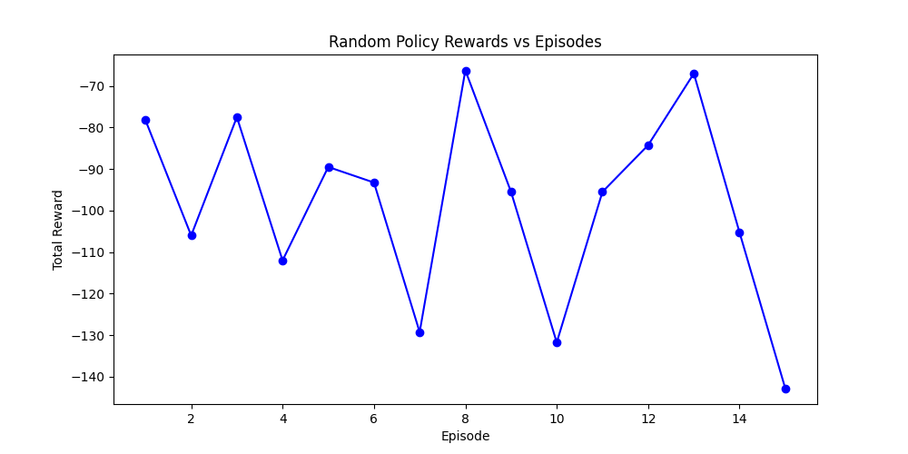

#  🚂 Railway Optimisation using Reinforcement Learning

The project implements a **custom railway simulator** integrated with **Deep Q-Network (DQN)** reinforcement learning to optimize train scheduling and reduce passenger delay in railway networks, including real-world scenarios like the **Chennai Metro system**.
An extensive report of the project with experimentation and result is included in this repository as Report.pdf

The simulator models:

- Train transitions  
- Passenger boarding/deboarding  
- Line switching at junctions  
- Dynamic event triggers  
- A signaling system that adapts halt times based on passenger queues and train capacity

Key classes include **Train**, **Section**, **Junction**, **Line**, and **Passenger**, capturing the network’s operational states and activities.

---

## Project Structure

### **1. `CustomSimulator/`**
Contains the core railway network simulation logic.

### **2. `RLIntegration/`**
Implements DQN-based reinforcement learning applied to the simulator environment.

Contents of `RLIntegration/`:
```
RLIntegration/
├── Chennai_metro/ # Chennai Metro–specific simulation setup
├── Common_junction/ # Shared junction simulation setup
├── DQN_Agent.py # Deep Q-Network agent implementation
├── RL_Integrated_Custom_simulator.py # RL integrated with the custom simulator
├── RL_on_chennai_metro.py # RL execution on the Chennai Metro model
├── object_creation_modified.py # Train, junction, and section object creation utilities
├── passenger_generation.py # Passenger arrival and generation logic
```

---

## User Inputs Required

- **Network description file** specifying:
  - Train details: name, line, start time, speed, capacity  
  - Junction details: name, line, signal status, coordinates, passenger arrival rates  
  - Section connections between junctions  

- **RL training parameters**,(will be added for each junction) including:
  - Number of episodes  
  - DQN hyperparameters (`epsilon`, `gamma`, `learning_rate`)

---

## Outputs Generated

- **Train timetables** (arrival & departure times at each junction/section)  
- **Final passenger list** with journey details and computed delays  
- **Reward logs**: negative passenger delays per episode (used to track RL performance)

---

## Reinforcement Learning Behavior

The DQN agent trains over multiple episodes, learning to minimize total passenger delay by making decisions at junctions—e.g., whether to:

- Wait for transferring passengers  
- Proceed to the next section

Training output shows fluctuating negative rewards as the agent explores and improves.  
Tuning **epsilon**, **gamma**, and other hyperparameters can further refine performance.

---
## Our scenarios

We experimented our RL agent on 2 major scenarios:
1. Cross-Junction : 
When 2 lines intersect each other and have a common junction


2. Chennai Metro : 
We expanded our experiment to include a real life example, that of the Chennai metro network which has 2 common junctions.
---
## How to Run the Code

Follow these steps to execute the simulator and RL environment.

### **1. Clone the Repository**
```bash
git clone https://github.com/ishanayar1/Custom_simulator.git
cd Custom_simulator
```
### 2. Go to the RLIntegration Directory
```bash
cd RLIntegration
```
###  3. Choose the Scenario to Run

If you want to run the **Common Junction** scenario:

```bash
cd Common_junction
```

or if you want to run **Chennai Metro** scenario
```bash
cd Chennai_metro
```
###  4. Provide User Input
Each scenario requires a specific input file:

Common Junction scenario:
Provide inputs in common_junction.txt

Chennai Metro scenario:
Provide train configuration in chennaitrains_list.txt

Modify the .txt file as needed for your simulation setup.

### 5. Return to RL Integration
After editing the input file:
```bash
cd ..
```
### 6. Run the Appropriate Script 
For the Custom Simulator (Common Junction):
```bash
python RL_Integrated_Custom_simulator.py
```
For Chennai Metro Simulation:
```bash
python RL_on_chennai_metro.py
```
### 7. View the Outputs 

After the run completes, inside the respective scenario folder you will find:

- final_passenger.txt
Contains the final passenger list with delays and journey details.

- Reward Plot Images
Visual representation of RL reward progression over episodes.

Both set of files are automatically generated in the selected scenario folder.


---
## Output example of Common_junction scenario.
Following plots are the rewards over episode for the scenario when 2 lines intersect each other at a common junction.

### Reward Plot


### Optimal Reward


### Random Reward


We can observe that the Optimal policy gives us the minimum possible delay than Random policy. 


## Summary

This custom simulator and RL framework effectively model complex metro scenarios—such as intersecting lines, dynamic signaling, and passenger flow—and provide insights applicable to real-world railway systems.
